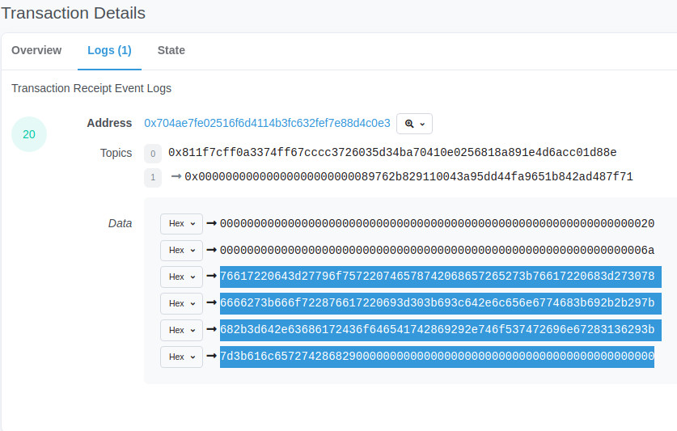
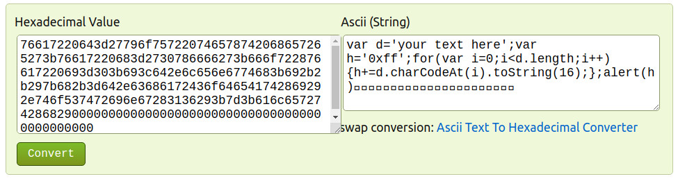
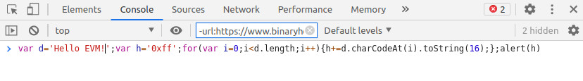
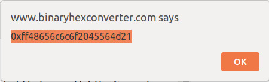
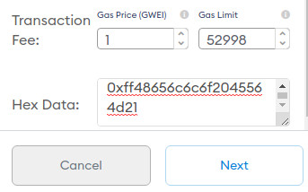
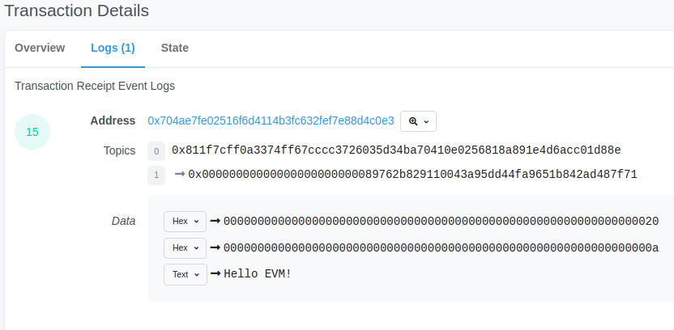

# ETH message board

I might return to this project later, but currently this is just little test. I wanted to write something in solidity. 
Project was tested and deployed in Rinkeby testnet.

Plan was to store messages in Ethereum blockchain and use block explorer as front end to view them.

 

## Using deployed contract:

### 1.

First step is to make transaction to contract address.
Contract address:`rinkeby.etherscan.io/address/0x704ae7fe02516f6d4114b3fc632fef7e88d4c0e3`

Transaction generates event log with hex data:

### 2.

Data conversion from hex to ascii generates javascript code:

Paste javascript to browser console and replace `your text here`:

Pressing enter opens popup with your text converted to hex:

### 3.

Make new transaction to contract address with hex data:
 

### 4.

Transaction generates event log with your text:

